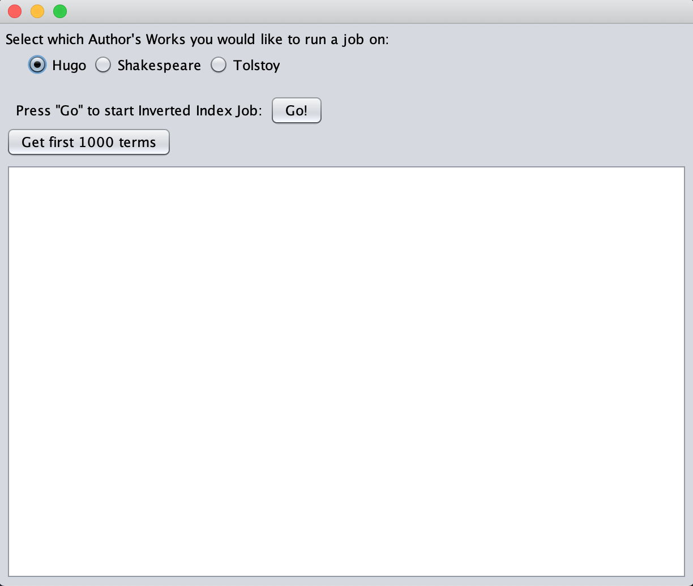

# cs1660-project

## Items Tackled
* First Java Application Implementation and Execution on Docker
* Docker to Local (or GCP) Cluster Communication
* Inverted Indexing MapReduce Implementation and Execution on the Cluster (GCP)
* Video of code walkthrough and application execution (`Walkthrough.7z`)

Here is a screenshot of what the application looks like:

## How to run
1. `docker build --tag <insert tag> .`
2. `docker run -it --privileged -e DISPLAY=<IP>:0 -v /tmp/.X11-unix:/tmp/.X11-unix <tag>:latest` (replace `<IP>` with your IP)
3. Select the author whose works you want to run an Inverted Index job on
4. Press Go
5. Wait for the job to finish
6. Press the "Output first 1000" button.